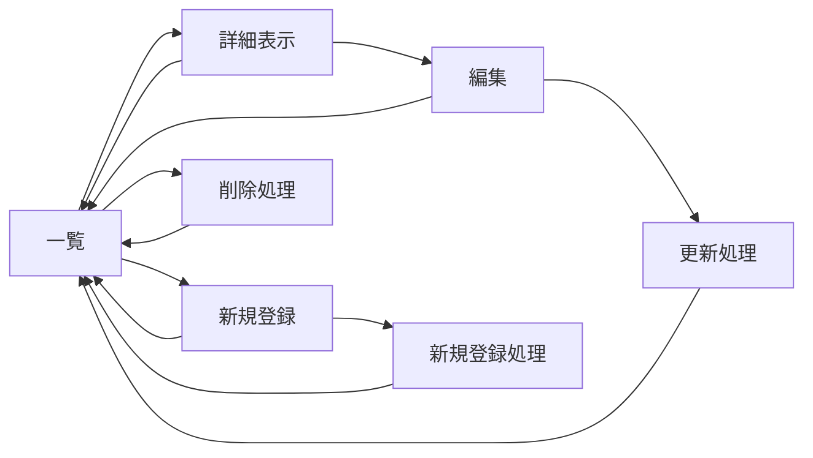

#　やってみよう９
#### システムを使う対象
私

## システムの対象
#### キュゥべえの各話のセリフ一覧(アニメ)
- 第一話
諦めたらそれまでだ。でも、君なら運命を変えられる。避けようのない滅びも、嘆きも、全て君が覆せばいい。そのための力が、君には備わっているんだから。
僕と契約して、魔法少女になって欲しいんだ！
- 第二話
- 第三話
まどか。先に行ってくれ。さやかには僕がついてる。
二人とも！今すぐ僕と契約を！まどか！さやか！願い事を決めるんだ、早く！
- 第四話
- 第五話
- 第六話
- 第七話
- 第八話
- 第九話
- 第十話
- 第十一話
- 第十二話
　

#### ゼルダの分岐一覧
- 時のオカリナの前
  - スカイウォードソード
  - ふしぎのぼうし
  - 4つの剣
- 時のオカリナ
- 時の勇者敗北ルート
  - 神々のトライフォース
  - 夢を見る島
  - ふしぎの木の実
  - 神々のトライフォース2
  - トライフォース3銃士
  - 知恵のかりもの
  - ゼルダの伝説
  - リンクの冒険
- 時の勇者勝利ルート
  - 大人時代
    - 風のタクト
    - 夢幻の砂時計
    - 大地の汽笛
  - 子供時代
    - ムジュラの仮面
    - トワイライトプリンセス
    - 4つの剣＋(ハイラルアドベンチャー)

#### ページ遷移図

#### 歴代のマジカルミライ
- 2013
テーマ:
- 2014
テーマ:
- 2015
テーマ:
- 2016
テーマ:
- 2017
テーマ:
- 2018
テーマ:
- 2019
テーマ:
- 2020
テーマ:
- 2021
テーマ:
- 2022
テーマ:
- 2023
テーマ:
- 2024
テーマ:
- 2025
テーマ:
### ページ遷移
### スキーマ