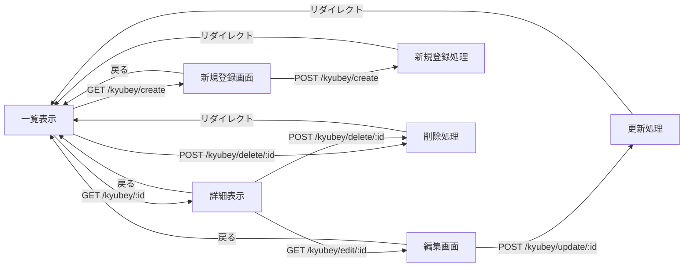
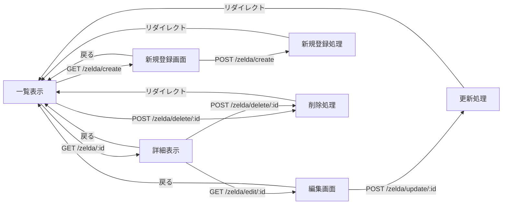
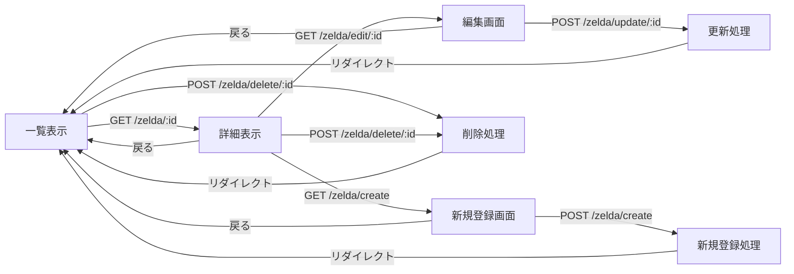
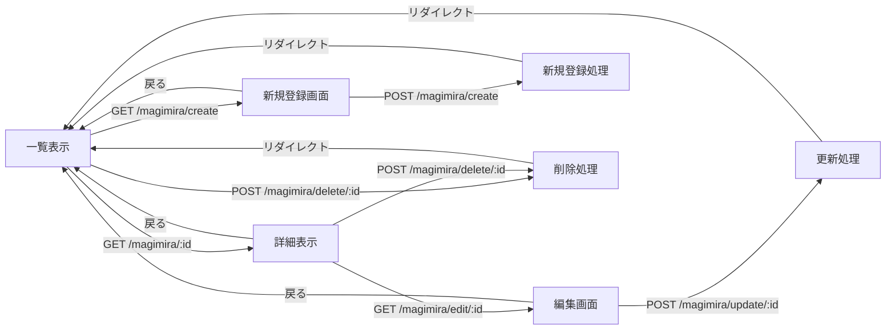

#　開発仕様書(仮)
## キュゥべえの各話のセリフ一覧(アニメ)システム
| 機能 | メソッド | リソース名 | 処理内容 |
| :--- | :--- | :--- | :--- |
| 一覧表示 | GET | `/kyubey` | セリフデータの一覧を表示する |
| 詳細表示 | GET | `/kyubey/:id` | 指定IDのセリフ詳細を表示する |
| 新規登録画面 | GET | `/kyubey/create` | 新規登録フォームを表示する |
| 新規登録処理 | POST | `/kyubey/create` | フォームデータを配列に追加し一覧へ戻る |
| 編集画面 | GET | `/kyubey/edit/:id` | 指定IDの編集フォームを表示する |
| 更新処理 | POST | `/kyubey/update/:id` | 指定IDのデータを更新し一覧へ戻る |
| 削除処理 | POST | `/kyubey/delete/:id` | 指定IDのデータを削除し一覧へ戻る |

## ゼルダの伝説時系列システム

| 機能 | メソッド | リソース名 | 処理内容 |
| :--- | :--- | :--- | :--- |
| 一覧表示 | GET | `/zelda` | セリフデータの一覧を表示する |
| 詳細表示 | GET | `/zelda/:id` | 指定IDのセリフ詳細を表示する |
| 新規登録画面 | GET | `/zelda/create` | 新規登録フォームを表示する |
| 新規登録処理 | POST | `/zelda/create` | フォームデータを配列に追加し一覧へ戻る |
| 編集画面 | GET | `/zelda/edit/:id` | 指定IDの編集フォームを表示する |
| 更新処理 | POST | `/zelda/update/:id` | 指定IDのデータを更新し一覧へ戻る |
| 削除処理 | POST | `/zelda/delete/:id` | 指定IDのデータを削除し一覧へ戻る |

## 歴代マジカルミライシステム

| 機能 | メソッド | リソース名 | 処理内容 |
| :--- | :--- | :--- | :--- |
| 一覧表示 | GET | `/magimira` | セリフデータの一覧を表示する |
| 詳細表示 | GET | `/magimira/:id` | 指定IDのセリフ詳細を表示する |
| 新規登録画面 | GET | `/magimira/create` | 新規登録フォームを表示する |
| 新規登録処理 | POST | `/magimira/create` | フォームデータを配列に追加し一覧へ戻る |
| 編集画面 | GET | `/magimira/edit/:id` | 指定IDの編集フォームを表示する |
| 更新処理 | POST | `/magimira/update/:id` | 指定IDのデータを更新し一覧へ戻る |
| 削除処理 | POST | `/magimira/delete/:id` | 指定IDのデータを削除し一覧へ戻る |

