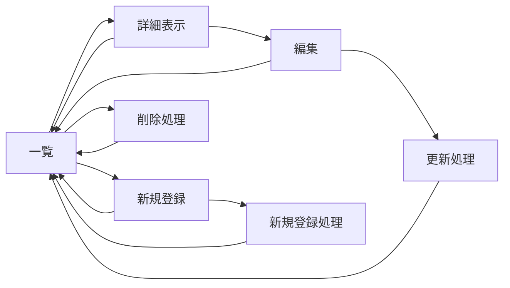

#　開発仕様書(仮)
## キュゥべえの各話のセリフ一覧(アニメ)システム
- 第一話
諦めたらそれまでだ。でも、君なら運命を変えられる。避けようのない滅びも、嘆きも、全て君が覆せばいい。そのための力が、君には備わっているんだから。
僕と契約して、魔法少女になって欲しいんだ！
- 第二話
- 第三話
まどか。先に行ってくれ。さやかには僕がついてる。
二人とも！今すぐ僕と契約を！まどか！さやか！願い事を決めるんだ、早く！
- 第四話
お別れだね。僕はまた、僕との契約を必要としてる子を探しに行かないと。短い間だったけど、ありがとう。一緒にいて楽しかったよ、まどか。
- 第五話
- 第六話
- 第七話
- 第八話
- 第九話
- 第十話
- 第十一話
- 第十二話
君は、本当に神になるつもりかい？
　

## ゼルダの伝説時系列システム
- 時のオカリナの前
  - スカイウォードソード
  - ふしぎのぼうし
  - 4つの剣
- 時のオカリナ
- 時の勇者敗北ルート
  - 神々のトライフォース
  - 夢を見る島
  - ふしぎの木の実
  - 神々のトライフォース2
  - トライフォース3銃士
  - 知恵のかりもの
  - ゼルダの伝説
  - リンクの冒険
- 時の勇者勝利ルート
  - 大人時代
    - 風のタクト
    - 夢幻の砂時計
    - 大地の汽笛
  - 子供時代
    - ムジュラの仮面
    - トワイライトプリンセス
    - 4つの剣＋(ハイラルアドベンチャー)

#### ページ遷移図

## 歴代マジカルミライシステム
- 2014
テーマソング:「ネクストネスト」(さつき が てんこもり)
- 2015
テーマソング:「Hand in Hand」(kz(livetune))
- 2016
テーマソング:「39みゅーじっく！」(みきとP)
- 2017
テーマソング:「砂の惑星」(ハチ)
- 2018
テーマソング:「グリーンライツ・セレナーデ」(Omoi)
- 2019
テーマソング:「ブレス・ユア・ブレス」(和田たけあき)
- 2020
テーマソング:「愛されなくても君がいる」(ピノキオピー)
- 2021
テーマソング:「初音天地開闢神話」(CosMo@暴走P)
- 2022
テーマソング:「フューチャー・イヴ」(sasakure.UKと有形ランペイジ)
- 2023
テーマソング:「HERO」(Ayase)
- 2024
テーマソング:「アンテナ39」(柊マグネタイト)
- 2025
テーマソング:ラストラス(*Luna)
### ページ遷移
### スキーマ